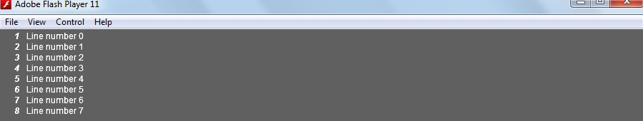

FlashLightCon
=================

FlashLightCon is a simple sprite-based console for Flash-based applications.

If you're having trouble connecting to the Flash Debugger (possibly because of version conflict or localhost problems), you can temporarily use FlashLightCon for console-based debugging. It acts as a sprite-based console which you can use on your application to display output from Flex's trace() method.

Setup and Usage
---------------
1. Import the package lightcon on your project.
2. On your main sprite (or any sprite that has access to the *stage*), add the line below. *embed(...)* accepts *Sprite* as a parameter. Make sure that the object you're passing has access to the stage.

    `LightConsole.embed(this);`

3. Display output on the FlashLightCon console by calling its print(object:Object) method.

    `LightConsole.print("Hello, world!");`

4. When running your application, press F1 to display the console.
